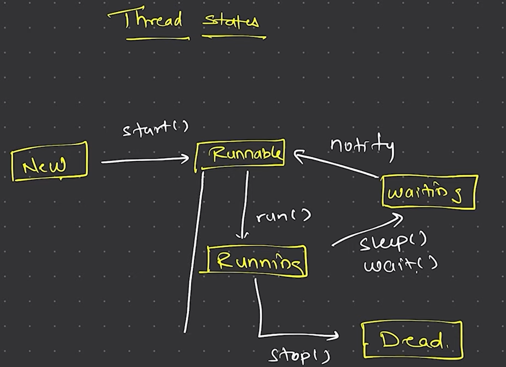

# [JDK[JRE[JVM]]]

# Basics

### Have your public class one per file at the top of the file
### All the variables in interface are final and static because interface doesn't have it's own memory like concrete class
### Can't create object of abstract class and all the method of abstract class must be implemented in the child class
### Enums are like class you cant extend them, but we can define method variable and other things

# FINAL

### Once varable is final it can't be changed

### Once class is final iheritence is stopped

### Once method is final stop method overriding

# UPCASTING AND DOWNCASTING

### UPCASTING: assign child value to parent type (dynamic method dispactch or runtime polymorphism)

### DOWNCASTING: revert to child type by explicit casting

# Wrapper Class

### For every primitive data type we have class for it, like int -> Integer eg. int n=7; Integer n=new Integer(n) also called boxing revert is unboxing;

# Collection
### collection api is concept of collections
### Collection is interface
### Collections is a class

# Threads
### use imuttable variables to be thread safe or synchronised mehthods when want to be thread safe
## Thread states

# Comparison
### Comparator is class which creates a comparator to sort which will be passed in Collections.sor(list,comparator)
### Comparable is interface that gives power to the class itself how to compare it by overriding compareTo method
### to compare strings use string1.compareTo(string2): if equals return 0 if greater return +ASCI code if less return -ASCI code

# Stream API
### Once used the Stream variable it can't be reused

# Networking

